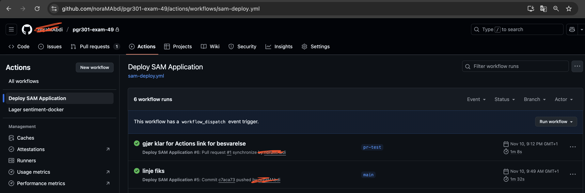
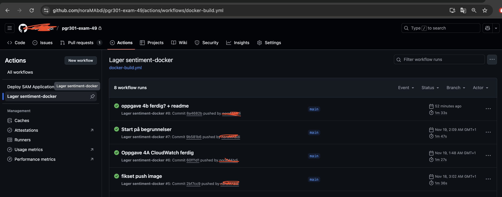
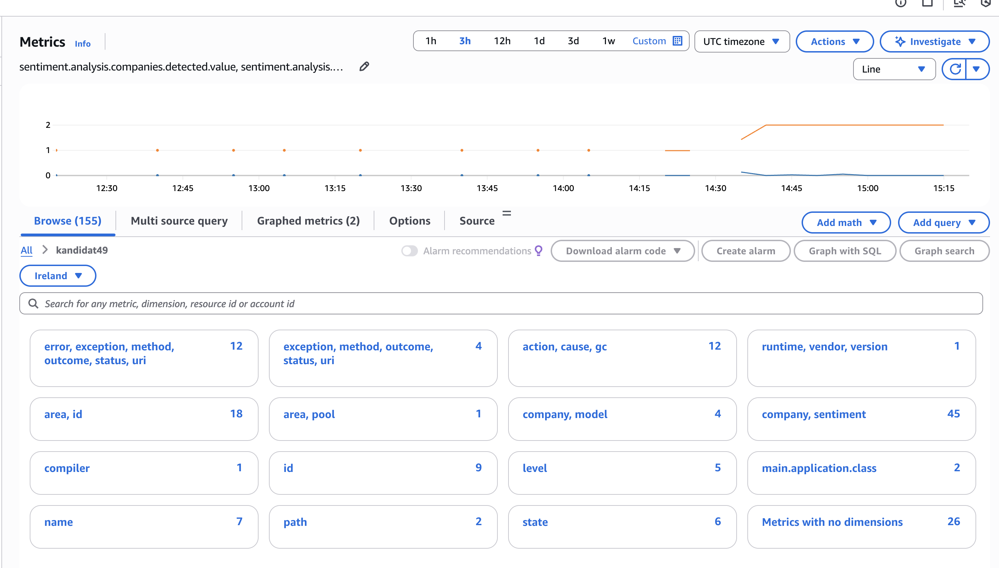
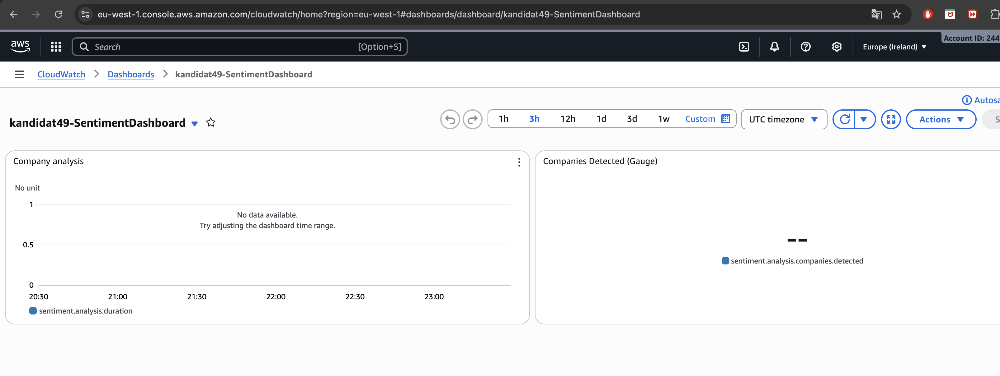

# Oppgave 2

## Del A: 
Http-endpoint: https://kuczeewwa5.execute-api.eu-west-1.amazonaws.com/Prod/analyze/

S3 Object: s3://user49-data/midlertidig/comprehend-20251108-212618-2718ec4f.json

## Del B:

Fikset .yml fil: https://github.com/noraMAbdi/pgr301-exam-49/blob/c7aca7394fc129d59f1151f0c48d6b27ae5cc6e9/.github/workflows/sam-deploy.yml
Riktig Actions run: https://github.com/noraMAbdi/pgr301-exam-49/actions/runs/19225890966/workflow

# PR test branch
https://github.com/noraMAbdi/pgr301-exam-49/actions/runs/19244777057

# Instruksjoner til sensor – slik kjører du workflow’en på din egen GitHub-konto

For å kjøre GitHub Actions-workflowen på din egen konto, vennligst følg disse trinnene:

## 1. Fork repositoriet mitt

Gå til GitHub-repoet:
-  https://github.com/noraMAbdi/pgr301-exam-49

Klikk Fork (øverst til høyre).
Dette lager en kopi i din egen GitHub-konto.

## 2. Sett opp GitHub Secrets i ditt repo

Workflowen bruker miljøvariabler og AWS-nøkler via GitHub Secrets.

Gå til:
- Settings → Secrets and variables → Actions

Opprett følgende secrets (samme navn som i workflow-filen min):

- AWS_ACCESS_KEY_ID
- AWS_SECRET_ACCESS_KEY

## 3. Aktiver nødvendige tilatelser for GitHub Actions

Workflowen krever at Actions kan deploye og skrive til repoet.

Gå til:
- Settings → Actions → General

Under Workflow permissions, velg:
- Read and write permissions
- Huk av Allow GitHub Actions to create and approve pull requests

## 4. Kjør workflowen manuelt

- Gå til Actions i repoet.

- Velg workflowen “Deploy SAM Application”.

- Klikk Run workflow (grønn knapp).

Vent til jobben fullfører (grønn checkmark).

----

# Oppgave 3
## Del A
Dockerfile er korrigert i mappen sentiment-docker

## Del B
- Vellykket run https://github.com/noraMAbdi/pgr301-exam-49/actions/workflows/docker-build.yml
  

For å kjøre Docker-bygge-workflowen i din egen GitHub-konto, gjør følgende:

### 1. Fork repoet mitt

Gå til repoet:
https://github.com/noraMAbdi/pgr301-exam-49

Klikk Fork.

### 2. Sett opp GitHub Secrets

Workflowen bruker Docker Hub-innlogging i secrets.

I din fork, gå til:
- Settings → Secrets and variables → Actions

Opprett disse secrets:

- DOCKER_USERNAME

- DOCKER_TOKEN

(Dette er identiske navn som workflowen forventer.)

### 3. Gi Actions nødvendige rettigheter

Gå til: Settings → Actions → General

Under Workflow permissions velger du:

Read and write permissions

### 4. Kjør workflowen manuelt

Gå til Actions

- Velg workflowen “Lager sentiment-docker”
- Klikk Run workflow

Når den er ferdig vil du få en grønn checkmark og et Docker-image med samme tag som workflowen genererer - v1

----

# Oppgave 4
## Del A -
## Designvalg for Cloudwatch metrikkene og Micrometer
For denne oppgaven implementerte jeg fire custom metrics i Micrometer for å se hvordan applikasjonen oppfører seg når den gjør sentimentanalyse via AWS Bedrock. Valgene mine var basert på hva jeg synes var aktuelt og interessant for konteksten til oppgaven. 
Jeg valgte Micrometer instrumentene Counter, Gauge, Timer og DistributionSummary for denne oppgaven.
### 1. Counter
sentiment.analysis.total måler antall sentimentanalyser som er utført og blir filtrert på selskap og sentimenttype som f.eks positive og negative. Den kan peke på aktiviteten i systemet, og siden den kun øker er det enklere å forstå.

Jeg valgte at Counter fordi den brukes til metrikker som representerer antall ganger noe skjer. En counter øker bare som gjør det enklere å telle hendelser. Jeg ville ha oversikt over hvor mange ganger jeg hadde 'postive' eller 'negative' følelser mot et selskap fordi jeg syntes at det var realistisk.

### 2. Timer
Timer valgte jeg fordi responstid er en av de mest praktiske og intuitive metodene å vurdere ytelsen på. Jeg vile vite hvor lang tid en analyse tar, med tanke på kommunikasjonen den har med en ekstern API. For meg var dette en måte å se om noe går tregere enn det burde.

### 3. Gauge
Gauge git en øyeblikksverdi som kan øke og synke. Å ha overskikt over hvor mange selskaper som ble funnet i akkurat den siste analysen. Det påpeker en "nåvæerende-tilstand" istedenfor å være en teller, som er derfor jeg valgte Gauge i tillegg til de ande metrikkene. 

### 4. DistributionSummary
Konfidensscoren til metrikken er med på indikere kvaliteten på analysene som jeg var opptatt av. Scoren varierer på analysene, og lot meg se hele spennet. Jeg valgte DistrubutionSummary fordi den lot meg forstå hvordan kvaliteten på analysense fordeler seg over tid.

## Del B

Prøvde veldig lenge men det ville verdiene ville ikke dukke opp på dashbordet.

---
# Oppgave 5
Kunstig Intelligens assistenter som Copilot og Claude er en naturlig del av hverdagen for mange utviklere. KI-assistenter har nesten erstattet typiske ressurser som Stackoverflow, Github, Youtube, GeekForGeeks, osv. Personlig hjelper KI meg med å forstå store konsepter og fungerer som en samtalepartner om mine egne tanker og forslag. Basert på min tidligere erfaring, kan jeg se hvordan dette verktøyet påvirker Devops prinsippene, Flyt, Feedback og Kontinuerlig læring.

## 1.Flyt (Flow)
KI-verktøy kan betydelig øke farten i utviklingsprosessen. Basert på erfaringer med KI assistenter opplever jeg at tid reduseres, tid som jeg ellers ville brukt på å søke gjennom dokumentasjon, artikler eller videoer for å løse et problem. Når jeg var usikker på egen løsningslogikk, kunne KI raskt gi eksempler, foreslå alternative tilnærminger eller påpeke feil i min kode. Dette bidrar til at flyten ikke avbrytes av små og hyppige flaskehalser. I tillegg reduserer den mentale belastningen når verktøyet kan omforme ideer til kode eller foreslå strategier på få sekunder

Likevel, kan KI skape nye flaskehalser. Språkmodeller kan "hallusinere" som vil si produsere informasjon som ikke stemmer eller ta usanne antakelser om prosjektet. Basert på forholdet man har til KI assistenten, kan en overse feilene og det tar lengere tid å feil søke. I tillegg, kan koden se korrekt ut, men ikke fungere ved integrasjon. Slike feil kan skape mer arbeid i team som nå må bruke tid på kontrollere begrunnelser, feil søke, forstå eller fjerne den KI genererte koden. Dermed kan KI både forsinke og fremdrive flyten, men er avhengig av hvordan verktøyet brukes. 

## 2. Feedback
Etter min vurdering er KI-assistenter mest aktuelle og effektive når det gjelder feedback. Siden disse verktøyene er språkmodeller (Language Learning Models) trent på store mengder tekst data, kan de dekke et bredt område av tidligere løsninger, eksempler og mønstre. Dette resulterer i raske forklaringer, alternative fremgangsmåter og feilsøking i sanntid. En slik respons bidrar til en mer dynamisk og iterativ utviklingsprosess, og støtter Devops prinsippet om korte og hyppige tilbakemeldingssløyfer.

Samtidig vil språkmodellen føre til begrensinger. KI-assistenter kan gi kode eller begrunnelser som er helt feilslått, men feedbacken kan fremdeles framstå som overbevisende. Dette kan føre til falsk trygghet, dersom brukeren ikke aktivt evaluerer svaret. Videre har modellen kun tilgang til den begrensede informasjonen som brukeren deler, med mindre man deler hver eneste del av prosjektet og konteksten. Dette kan føre til upresis eller helt misvisende feedback.

## 3. Kontinuerlig læring
Til en viss grad kan man telle KI-verktøy som faktiske læringspartnere. De gir forklaringer, svarer i sanntid og hjelper utviklere å forstå konsepter eller kode som ville tatt lenger tid å lære. Jeg merket at jeg lærte fortere av å stille spørsmål til modellen istedenfor å spørre medelever eller søke på nettet selv. Det skaper en kultur hvor det er enklere for utviklere å eksperimentere og forbedre sine evner. Dette passer til Devops fokuset på kontinuerlig forbedring.
Samt finnes det risikoer. Hvis utviklere blir avhengig av KI, kan vi miste dybdeforståelsen som trengs for å faktisk bygge store prosjekter på egen kunnskap. Når verktøyet gjør mye av tankearbeidet så lærer man mindre om hvordan og hvorfor løsningen fungerer. Organisasjoner og potensielt skoler må derfor jobbe med bevisst bruk og kunnskapsdeling. Slik at KI faktisk forblir et verktøy og ikke et første valg.

## Konklusjon
KI assistenter påvirker alle tre Devops-prinsippene sterkt, i både negativ og positiv sammenheng. KI kan øke flyt drastisk, gi raskere og kreativ feedback og støtte utviklere i kontinuerlig læring. Samtidig kan den svekke det man ville unngå som dårlig kvalitet på kode, forvirrende feedback og svekket dybdekunnskap.
Min erfaring er at KI er mest nyttig når det brukes bevisst og kritisk. Altså, ikke benytte eller stole på assistenten mer jeg hadde stolt på andre kilder som Stackoverflow, YouTube eller forelesningsmateriale. Likevel, med riktig balanse kan KI løfte og opprettholde Devops praksis, så lenge man har refleksjon slik at det ikke hindrer læring og kvalitet.
