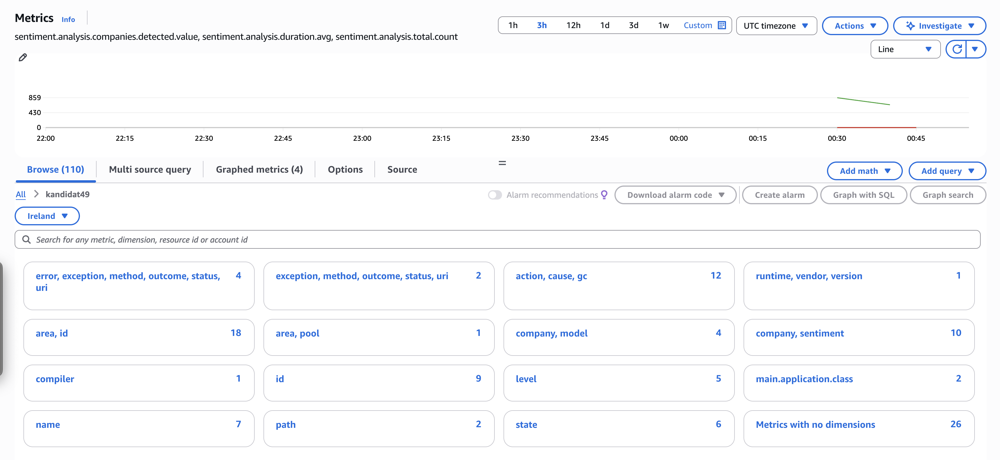

# Oppgave 2

## Del A: 
Http-endpoint: https://kuczeewwa5.execute-api.eu-west-1.amazonaws.com/Prod/analyze/

S3 Object: s3://user49-data/midlertidig/comprehend-20251108-212618-2718ec4f.json

## Del B:

Fikset .yml fil: https://github.com/noraMAbdi/pgr301-exam-49/blob/c7aca7394fc129d59f1151f0c48d6b27ae5cc6e9/.github/workflows/sam-deploy.yml
Riktig Actions run: https://github.com/noraMAbdi/pgr301-exam-49/actions/runs/19225890966/workflow

# PR test branch
https://github.com/noraMAbdi/pgr301-exam-49/actions/runs/19244777057

----

# Oppgave 3
## Del A
Dockerfile er korrigert i mappen sentiment-docker

## Del B
- Vellykket run https://github.com/noraMAbdi/pgr301-exam-49/actions/workflows/docker-build.yml

----

# Oppgave 4
## Designvalg for Cloudwatch metrikkene og Micrometer
For denne oppgaven implementerte jeg fire custom metrics i Micrometer for å se hvordan applikasjonen oppfører seg når den gjør sentimentanalyse via AWS Bedrock. Valgene mine var basert på hva jeg synes var aktuelt og interessant for konteksten til oppgaven. 
Jeg valgte Micrometer instrumentene Counter, Gauge, Timer og DistributionSummary for denne oppgaven.
### 1. Counter
sentiment.analysis.total måler antall sentimentanalyser som er utført og blir filtrert på selskap og sentimenttype som f.eks positive og negative.

Jeg valgte at Counter fordi den brukes til metrikker som representerer antall ganger noe skjer. En counter øker bare som gjør det enklere å telle hendelser. Jeg ville ha oversikt over hvor mange ganger jeg hadde 'postive' eller 'negative' følelser mot et selskap fordi jeg syntes at det var realistisk.

### 2. Timer

----

