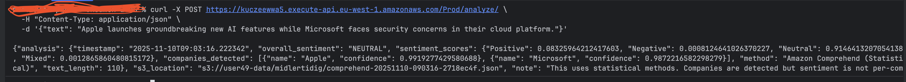

# Oppgave 2

## Del A: 
Http-endpoint: https://kuczeewwa5.execute-api.eu-west-1.amazonaws.com/Prod/analyze/

S3 Object: s3://user49-data/midlertidig/comprehend-20251108-212618-2718ec4f.json

## Del B:

Fikset .yml fil: https://github.com/noraMAbdi/pgr301-exam-49/blob/c7aca7394fc129d59f1151f0c48d6b27ae5cc6e9/.github/workflows/sam-deploy.yml
Riktig Actions run: https://github.com/noraMAbdi/pgr301-exam-49/actions/runs/19225890966/workflow

# PR test branch

----

# Oppgave 3
